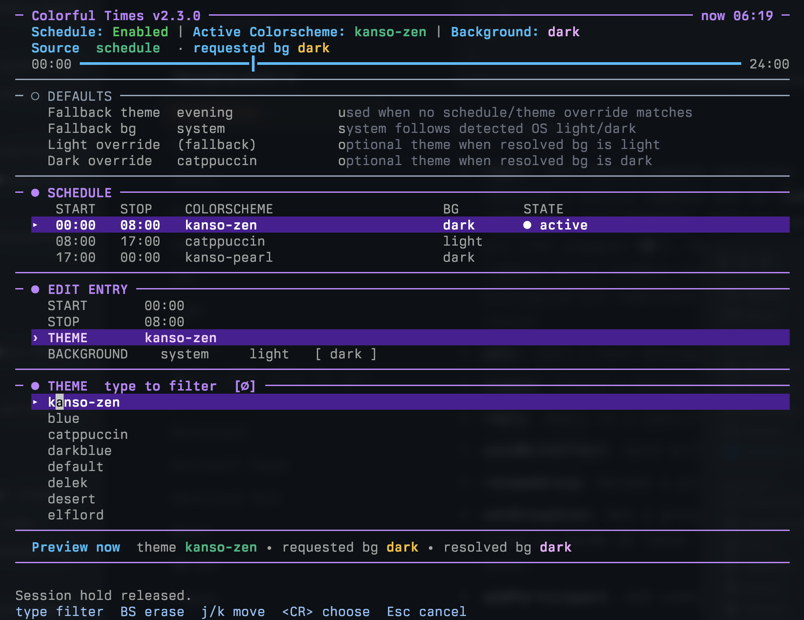

# Colorful Times


A fast, lightweight Neovim plugin that automatically changes your colorscheme based on time of day schedules or system appearance.

[](https://neovim.io/)
[](https://lua.org)
[](https://github.com/luxus/colorful-times-nvim/actions/workflows/ci.yml)

## Features

* Time-based schedules for automatic theme changes throughout the day.
* System appearance sync that follows your OS light or dark mode.
* Interactive TUI for both schedule entries and default theme settings.
* State persistence saves your changes automatically.
* Zero startup impact using fully asynchronous background detection.

## Schedule Manager TUI

Run `:ColorfulTimes` to open the interactive manager.



Adding or editing opens an inline drawer in the same buffer. Theme selection expands into an inline filterable list; moving through choices updates both the live preview and the preview summary line. Background selection is an inline segmented control for `system`, `light`, and `dark`. The preview line stays below the active sections so edits and selectors keep a stable layout.

### TUI Keymaps

| Key | Action |
|-----|--------|
| `j` / `Down` | Move down |
| `k` / `Up` | Move up |
| `Tab` | Switch focus between Defaults and Schedule |
| `a` | Add new schedule entry |
| `e` / `Enter` | Edit selected schedule row or focused default row |
| `d` / `x` | Delete selected schedule entry |
| `H` | Hold current theme for this session; press again to release |
| `t` | Toggle enabled or disabled |
| `r` | Reload configuration |
| `?` | Show help |
| `q` / `Esc` | Close TUI |

### Inline Editing

| Key | Action |
|-----|--------|
| `Tab` / `j` / `k` | Move between fields |
| `0-9` / `:` | Replace the active start or stop time; `14` becomes `14:00` |
| `Enter` | Open inline theme/background selector for the active field |
| `S` | Save draft and persist it |
| `O` | Hold current draft for this session; press again to release |
| `Esc` | Cancel and restore the preview snapshot; dirty schedule drafts ask for confirmation |

New entries default to the current resolved colorscheme/background. Time defaults come from the displayed chronological schedule: `start` is the stop time of the last displayed entry, and `stop` is the start time of the first displayed entry. Empty schedules default to `08:00`–`18:00`.

### Session Hold

`H` holds the currently resolved theme/background for the rest of the Neovim session. In edit mode, `O` holds the current draft preview. While held, scheduled changes and system background changes do not apply a different theme. Press the same key again to release it. The hold is runtime-only, appears in the TUI/status output, and disappears on restart.

### Theme Resolution Order

Colorful Times resolves the active theme in this order:

1. Runtime session hold, when active
2. Matching schedule entry
3. `default.background`
4. `default.colorscheme` or `default.themes.light` / `default.themes.dark`

If the resolved background is `system`, the plugin keeps a safe fallback first
and then updates to the detected light or dark background asynchronously.

## Installation

Using [lazy.nvim](https://github.com/folke/lazy.nvim):

```lua
{
  "luxus/colorful-times-nvim",
  lazy = false,
  priority = 1000, -- Colorscheme plugins must load first
  opts = {
    -- See configuration section below
  },
}
```

## Quick Start

```lua
require("colorful-times").setup({
  default = {
    colorscheme = "default",
    background = "system", -- "light", "dark", or "system"
  },
  schedule = {
    { start = "08:00", stop = "18:00", colorscheme = "tokyonight-day", background = "light" },
    { start = "18:00", stop = "08:00", colorscheme = "tokyonight-night", background = "dark" },
  },
})
```

## Configuration

Here are the default options.

```lua
{
  enabled = true,
  refresh_time = 5000, -- Milliseconds between system appearance polls
  system_background_detection = nil,
  system_background_detection_script = nil,
  default = {
    colorscheme = "default",
    background = "system",
    themes = { light = nil, dark = nil },
  },
  schedule = {},
  persist = true, -- Set to false to disable state persistence
}
```

The schedule manager TUI is fully inline: one compact floating window, one scratch buffer, live theme/background preview, inline selectors, and no extra edit popup.

## Commands

| Command | Description |
|---------|-------------|
| `:ColorfulTimes` | Open the interactive schedule manager |
| `:ColorfulTimesEnable` | Enable the plugin |
| `:ColorfulTimesDisable` | Disable the plugin |
| `:ColorfulTimesToggle` | Enable or disable the plugin |
| `:ColorfulTimesReload` | Reload configuration from disk |
| `:ColorfulTimesStatus` | Show the current resolved theme state, including session hold state |
| `:checkhealth colorful-times` | Run diagnostics |

## System Background Detection

The plugin detects your system appearance based on your OS environment.

Priority order:

1. `system_background_detection` as a Lua function override
2. `system_background_detection` as a command table override
3. macOS auto-detection via `osascript`, with `defaults read` fallback
4. Linux custom script via `system_background_detection_script`
5. Linux KDE/GNOME auto-detection via `kreadconfig5`/`kreadconfig6` or `gsettings`

The function and command overrides work on any platform. The custom script is
Linux-only.

## Troubleshooting

### macOS Shortcuts and Automations

If you use macOS keyboard shortcuts or Automator scripts to toggle system appearance, the change might not be detected immediately. The plugin relies on an asynchronous polling mechanism. You might need to wait 1 to 2 poll cycles. You can adjust the `refresh_time` in your configuration to a lower value for faster detection. If the theme still doesn't update, run `:ColorfulTimesReload` to force a manual check.

### State Persistence

When `persist = true`, the plugin saves schedule edits, toggle state, and
default theme settings to disk immediately. `:ColorfulTimesReload` rebuilds
the live config from your setup config plus the persisted state file.
Live preview snapshots and session holds are never persisted.

State file location:
`~/.local/share/nvim/colorful-times/state.json`

If the TUI shows unexpected entries or the configuration breaks, you can reset the state by deleting this file. The plugin will rebuild it from your configuration on the next run.

## API

You can call these public functions directly in your Lua configuration.

```lua
local ct = require("colorful-times")

-- Initialize the plugin with options
ct.setup({ ... })

-- Toggle the plugin enabled/disabled state
ct.enable()
ct.disable()
ct.toggle()

-- Reload the configuration and re-apply colorschemes
ct.reload()

-- Open the schedule manager TUI
ct.open()

-- Inspect the current resolved state
ct.status()

-- Hold/release a runtime-only theme for this Neovim session
ct.pin_session("tokyonight-night", "dark", "dark")
ct.unpin_session()
```

## Performance

Colorful Times is designed to stay close to the cost of the simplest possible colorscheme switcher while providing scheduling, persistence, system appearance sync, commands, status output, and the interactive manager TUI.

This benchmark was motivated by community feedback that time-based themes can be done in a very small amount of Lua, including [somnamboola's comment](https://www.reddit.com/r/neovim/comments/1suh8xr/comment/oi6w3yj/): “lmao, I did time based themes with 20 lines of lua”. That is a fair comparison point, so the repository includes a small independent reference implementation in `bench/minimal-switcher.lua`. It is intentionally kept under 50 lines and does not depend on Colorful Times. The benchmark compares Colorful Times against that reference across empty, scheduled, disabled, and hourly-schedule configurations.

Latest benchmark result from the optimization branch:

| Metric | Result |
|--------|--------|
| Startup/setup delta | Colorful Times measured `76.49µs` faster than the minimal switcher (`delta_us=-76.490804`) |
| Steady apply/switch delta | `3.52µs` slower, which is within benchmark noise (`apply_delta_us=3.521665`) |
| Cold first apply delta | Improved by about 14% versus the first-apply baseline (`149.531006µs` → `128.552002µs`) |
| Empty-schedule cold first apply | Near parity with the minimal switcher (`2.208008µs` delta) |

In practice, the larger implementation is not meaningfully slower than a 45-line switcher for the measured shared path, and startup is faster in this benchmark. The extra code buys the features that the minimal switcher intentionally does not include: validation, schedule management, persisted state, system appearance detection, commands, status, session holds, and the TUI.

To run the comparison locally:

```bash
./autoresearch.sh
```

The benchmark checks also guard the reference implementation: it must remain under 50 lines and must not reference Colorful Times modules.

## License

MIT License. See LICENSE for details.
